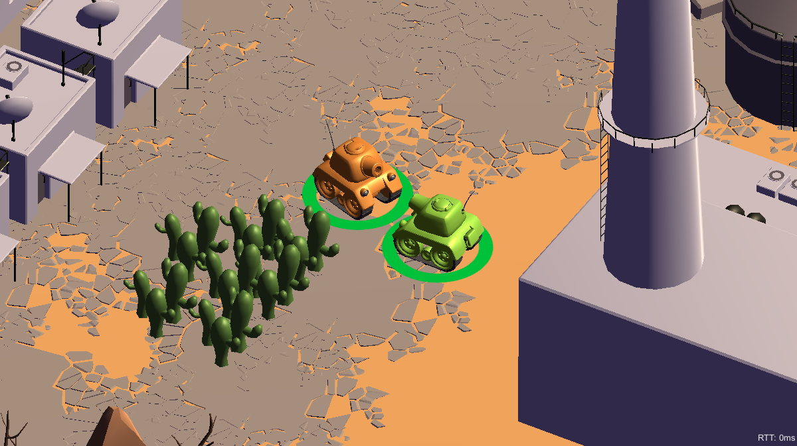

# Tanks-Extended

Game ini merupakan game lanjutan dari Tanks! tutorial dari Unity dengan beberapa tambahan fungsionalitas.

## Cara Kerja
Pertama kali player akan disediakan Menu: Play, Settings, About dan Quit.

Kemudian player akan memilih mode main (offline/online), sekaligus nama player.

Pada mode online, player akan memilih apakah masuk ke dalam server atau membuat server. Saat membuat server, player harus menunggu hingga ada player lain masuk. Saat masuk server, player akan ditanya apakah siap (Ready) atau tidak. Selanjutnya player-player tersebut akan main seperti biasa.

Pada mode offline, player tersebut akan langsung main seperti biasa dengan dua player local.

## Library yang Digunakan
- TextMeshPro yang dipakai untuk UI seperti teks, dropdown, atau input field
- Mirror yang dipakai sebagai networking API di mode permainan Multiplayer (https://assetstore.unity.com/packages/tools/network/mirror-129321)
- Asset Low Poly Army yang digunakan sebagai NPC Ally dari sebuah tank (https://assetstore.unity.com/packages/3d/characters/low-poly-soldiers-demo-73611)

## Screenshot

### Menu

### Prestart

### Online

### Offline

## Anggota dan Pembagian Tugas
- Nathaniel Evan 13516055: Weapon
- Ilham Syahid S. 13518028: Object Pooling, Multiplayer Game Mode, NPC Ally, Credits, Combine and Finishing
- Fathan Mubina 13518064: Map Baru
- Fakhrurrida Clarendia 13518091: Main Menu, Sound Settings, NPC Ally, Animasi Karakter Baru
